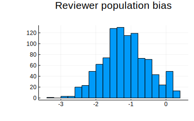
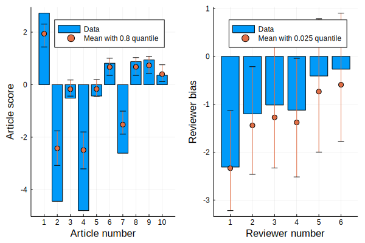
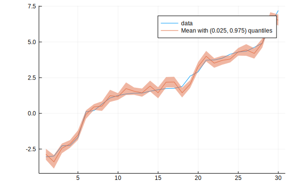
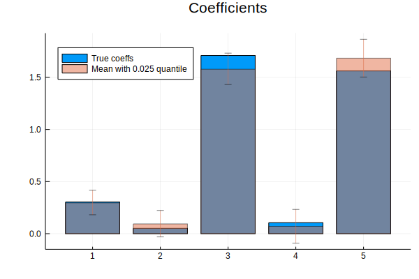
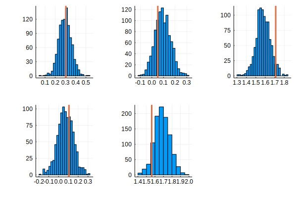

# Turing2MonteCarloMeasurements

[](https://travis-ci.com/baggepinnen/Turing2MonteCarloMeasurements.jl)
[](https://codecov.io/gh/baggepinnen/Turing2MonteCarloMeasurements.jl)
[](https://arxiv.org/abs/2001.07625)

This package serves as an interface between [Turing.jl](https://github.com/TuringLang/Turing.jl) and [MonteCarloMeasurements.jl](https://github.com/baggepinnen/MonteCarloMeasurements.jl). Turing, as a probabilistic programming language and MCMC inference engine produces results in the form of a `Chain`, a type that internally contains all the samples produced during inference. This chain is a bit awkward to work with in it's natural form, why this package exists and allows for the conversion of a chain to a named tuple of `Particles` from MonteCarloMeasurements.jl.

The probabilisitc programming language [Soss.jl](https://github.com/cscherrer/Soss.jl) already has support for `Particles` built in.

# Visualization
In this example, we simulate a review process where a number of reviewers are assigning scores to a number of articles. The generation of the data and the model specification are hidden under the collapsed section below.
<details>
<summary>Generate fake data and specify a model</summary>

```julia
using Turing, Distributions, Plots, Turing2MonteCarloMeasurements

nr = 5 # Number of reviewers
na = 10 # Number of articles
reviewer_bias = rand(Normal(0,1), nr)
article_score = rand(Normal(0,2), na)
R = clamp.([rand(Normal(r+a, 0.1)) for r in reviewer_bias, a in article_score], -5, 5)

Rmask = rand(Bool, size(R))
R = Rmask .* R
R = replace(Rmask, 0=>missing) .* R


m = @model reviewscore(R,nr,na) = begin
    reviewer_bias = Array{Real}(undef, nr)
    reviewer_gain = Array{Real}(undef, nr)
    true_article_score = Array{Real}(undef, na)
    reviewer_pop_bias ~ Normal(0,1)
    reviewer_pop_gain ~ Normal(1,1)
    for i = 1:nr
        reviewer_bias[i] ~ Normal(reviewer_pop_bias,1)
        reviewer_gain[i] ~ Normal(reviewer_pop_gain,1)
    end
    for j = 1:na
        true_article_score[j] ~ Normal(0,2.5)
    end
    rσ ~ TruncatedNormal(1,10,0,100)
    for j = 1:na
        for i = 1:nr
            R[i,j] ~ Normal(reviewer_bias[i] + true_article_score[j] + reviewer_gain[i]*true_article_score[j], rσ)
        end
    end
end
```
</details>


We now focus on how to analyze the inference result. The chain is easily converted using the function `Particles`
```julia
julia> chain = sample(reviewscore(R,nr,na), HMC(0.05, 10), 1500);

julia> cp = Particles(chain, crop=500); # crop discards the first 500 samples

julia> cp.reviewer_pop_bias
Part1000(0.2605 ± 0.72)

julia> cp.reviewer_pop_gain
Part1000(0.1831 ± 0.62)
```
Particles can be plotted
```julia
plot(cp.reviewer_pop_bias, title="Reviewer population bias")
```

```julia
f1 = bar(article_score, lab="Data", xlabel="Article number", ylabel="Article score", xticks=1:na)
errorbarplot!(1:na, cp.true_article_score, 0.8, seriestype=:scatter)
f2 = bar(reviewer_bias, lab="Data", xlabel="Reviewer number", ylabel="Reviewer bias")
errorbarplot!(1:nr, cp.reviewer_bias, seriestype=:scatter, xticks=1:nr)
plot(f1,f2)
```



# Prediction
The [linear-regression tutorial](https://turing.ml/dev/tutorials/5-linearregression/) for Turing contains instructions on how to do prediction using the inference result. In the tutorial, the posterior mean of the parameters is used to form the prediction. Using `Particles`, we can instead form the prediction using the entire posterior distribution.

Like above, we hide the data generation under a collapsable section.

<details>
<summary>Generate fake data</summary>

```julia
using Turing, Turing2MonteCarloMeasurements, Distributions, MonteCarloMeasurements
coefficients = randn(5)
x = randn(30, 5)
y = x * coefficients .+ 1 .+ 0.4 .* randn.()
sI = sortperm(y)
y = y[sI]
x = x[sI,:]
```
</details>

```julia
@model linear_regression(x, y, n_obs, n_vars) = begin
    # Set variance prior.
    σ₂ ~ TruncatedNormal(0,100, 0, Inf)

    # Set intercept prior.
    intercept ~ Normal(0, 3)

    # Set the priors on our coefficients.
    coefficients = Array{Real}(undef, n_vars)
    for i in 1:n_vars
        coefficients[i] ~ Normal(0, 10)
    end

    # Calculate all the mu terms.
    mu = intercept .+ x * coefficients
    for i = 1:n_obs
        y[i] ~ Normal(mu[i], σ₂)
    end
end;
n_obs, n_vars = size(x)
model = linear_regression(x, y, n_obs, n_vars)
chain = sample(model, NUTS(0.65), 2500);
```

In order to form the prediction, the original tutorial did
```julia
function prediction(chain, x)
    p = get_params(chain[200:end, :, :])
    α = mean(p.intercept)
    β = collect(mean.(p.coefficients))
    return  α .+ x * β
end
```
we will instead do
```julia
cp = Particles(chain, crop=500)
ŷ = x*cp.coefficients .+ cp.intercept
plot(y, lab="data"); plot!(ŷ)
```


```julia
bar(coefficients, lab="True coeffs", title="Coefficients")
errorbarplot!(1:n_vars, cp.coefficients, seriestype=:bar, alpha=0.5)
```


```julia
plot(plot.(cp.coefficients)..., legend=false)
vline!(coefficients', l=(3,), lab="True value")
```


# Further documentation
### MonteCarloMeasurements
[](https://baggepinnen.github.io/MonteCarloMeasurements.jl/stable)
[](https://baggepinnen.github.io/MonteCarloMeasurements.jl/latest)
[](https://arxiv.org/abs/2001.07625)

### Turing
[](https://turing.ml/dev/docs/using-turing/)
